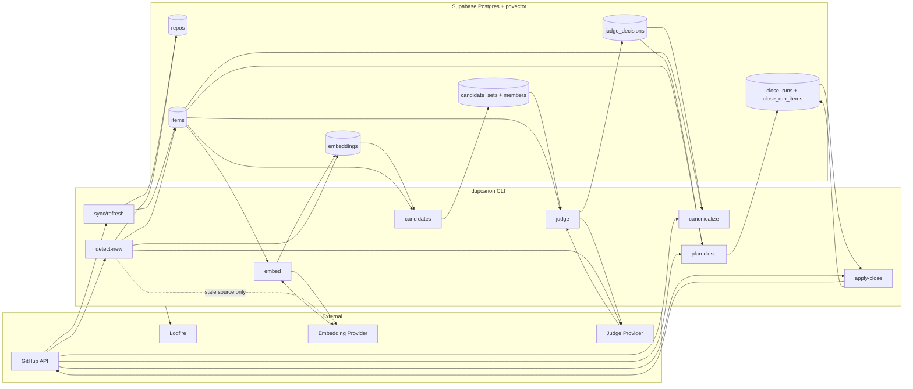
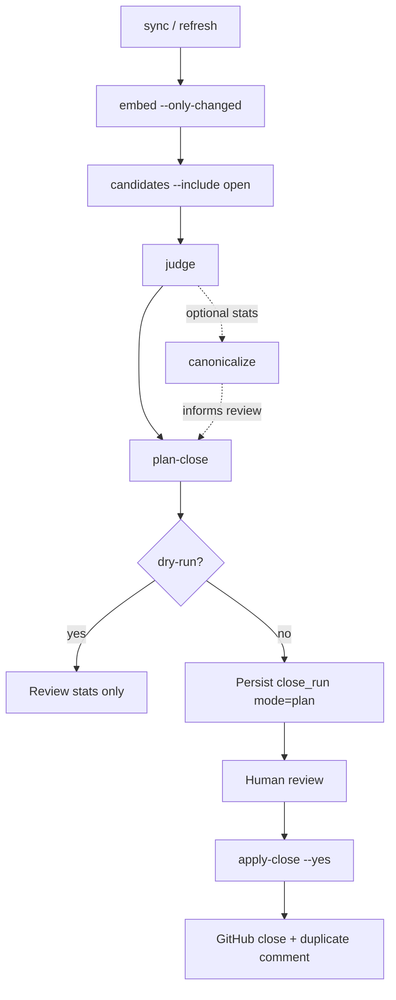
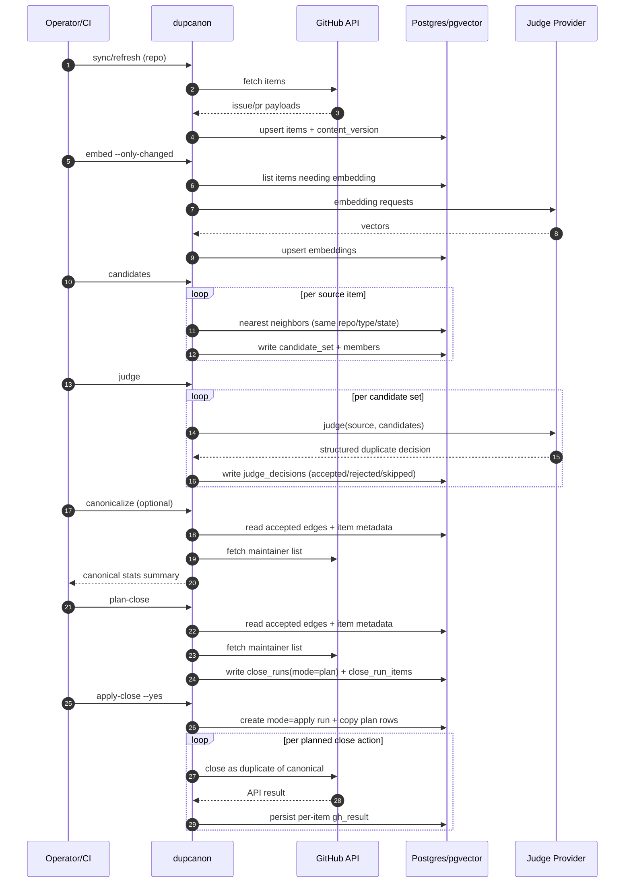
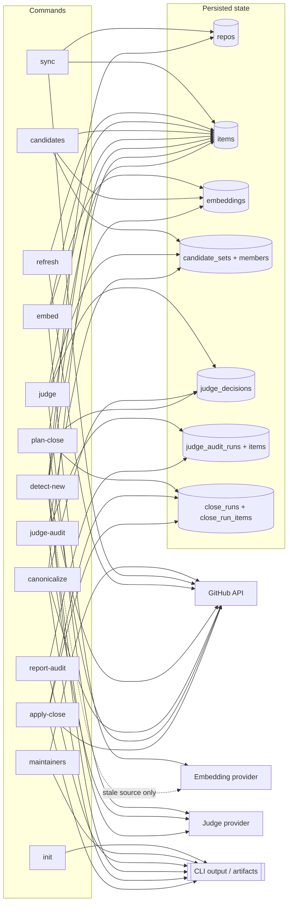

<Info>
This page is the adoption-facing architecture view: what each command reads/writes, how data moves through batch vs online paths, and where deterministic safety gates apply.
</Info>

## System architecture at a glance

<CardGroup cols={3}>
  <Card title="Data plane (state)">
    Supabase Postgres + pgvector stores items, embeddings, candidate snapshots, judge decisions, and close plans/results.
  </Card>
  <Card title="Decision plane">
    Embedding retrieval narrows candidates; LLM judgment proposes duplicate targets; deterministic policy gates accept/reject.
  </Card>
  <Card title="Action plane">
    Close actions are never direct from judge. They are gated through <code>plan-close</code> + explicit <code>apply-close --yes</code>.
  </Card>
</CardGroup>



## Two coordinated pipelines

<Tabs>
  <Tab title="Batch pipeline (many items)">

The batch path processes a repo corpus and produces reviewed close actions.



<Note>
For a batch of issues/PRs, each stage iterates over many source items. Artifacts are persisted after each stage so runs are restartable and auditable.
</Note>


  </Tab>

  <Tab title="Online pipeline (detect-new)">

`detect-new` classifies one newly opened issue/PR into `duplicate`, `maybe_duplicate`, or `not_duplicate`.

```mermaid
flowchart TD
  A[GitHub issue/pr opened] --> B[detect-new --repo --type --number]
  B --> C[fetch source item from GitHub]
  C --> D[upsert source into items]
  D --> E{embedding stale/missing?}
  E -- yes --> F[embed source and upsert embedding]
  E -- no --> G[reuse existing source embedding]
  F --> H[retrieve open same-type neighbors]
  G --> H
  H --> I{no candidates?}
  I -- yes --> J[not_duplicate: reason=no_candidates]
  I -- no --> K[judge source vs candidates]
  K --> L[apply strict guardrails + thresholds]
  L --> M[duplicate | maybe_duplicate | not_duplicate]
  M --> N[emit JSON output]
```

<AccordionGroup>
  <Accordion title="What detect-new persists vs does not persist">
    **Persists in v1:**

    - source row in `items` (upsert)
    - source embedding in `embeddings` when stale/missing

    **Does not persist in v1:**

    - no `candidate_sets` snapshot write
    - no `judge_decisions` row write
    - no close action
  </Accordion>
  <Accordion title="Strict duplicate guardrails in online mode">
    Duplicate verdict stays strict; high-confidence model output can still downgrade to `maybe_duplicate` when:

    - structural guardrails fail (`online_strict_guardrail:*`)
    - retrieval support is weak (`duplicate_low_retrieval_support`)
    - candidate-score gap is too small (`< 0.015`)
  </Accordion>
</AccordionGroup>

  </Tab>
</Tabs>

## Command-by-command information flow

<Warning>
This table is the operational truth for **what each command reads and writes**.
</Warning>

| Command | Primary input | Reads | Writes | Output role |
|---|---|---|---|---|
| `init` | local env/runtime | env + local runtime checks | none | readiness checks only |
| `maintainers` | `--repo` | GitHub collaborators/permissions | none | maintainer list for policy checks |
| `sync` | repo + type/state/since | GitHub issues/PRs | `repos` (upsert), `items` (upsert + content hash/version) | corpus ingest |
| `refresh` | repo + type | GitHub + existing `items` | `items` (discover new; optional metadata refresh) | incremental freshness |
| `embed` | repo + type | `items` needing vectors | `embeddings` | semantic retrieval substrate |
| `candidates` | repo + type + k/min_score | `items`, `embeddings` | `candidate_sets`, `candidate_set_members` (plus stale marking) | reproducible retrieval snapshot |
| `judge` | repo + type + provider/model | `candidate_sets` + source/candidate item context | `judge_decisions` (`accepted/rejected/skipped`) | accepted-edge graph source |
| `judge-audit` | sampled candidate sets | candidate sets + same judge runtime (cheap/strong lanes) | `judge_audit_runs`, `judge_audit_run_items` | evaluation + disagreement analysis |
| `report-audit` | audit run id | `judge_audit_runs`, `judge_audit_run_items` | none | reporting/simulation only |
| `detect-new` | single item number | GitHub item + DB corpus embeddings | `repos` (upsert), `items` (source upsert), `embeddings` (source if stale) | online JSON verdict |
| `canonicalize` | repo + type | accepted edges + item metadata + maintainer list | none (stats output) | canonical cluster computation |
| `plan-close` | repo + type + min_close | accepted edges + item metadata + maintainer list | `close_runs(mode=plan)`, `close_run_items` (unless dry-run) | reviewable close plan |
| `apply-close` | `close_run_id` + `--yes` | close plan rows + GitHub | `close_runs(mode=apply)`, `close_run_items` apply results | executed mutations |

## Command-to-state map (Mermaid)



## Where safety decisions happen

<CardGroup cols={2}>
  <Card title="Judge acceptance gate (batch)">
    Duplicate edges require valid structured response, candidate membership, <code>confidence >= 0.85</code>, open target, and score-gap <code>>= 0.015</code>.
  </Card>
  <Card title="Close planning gate">
    Close eligibility requires direct accepted edge to canonical, direct confidence <code>>= 0.90</code>, and maintainer author/assignee protections.
  </Card>
  <Card title="Apply mutation gate">
    No mutation happens without persisted <code>mode=plan</code> run and explicit <code>--yes</code>.
  </Card>
  <Card title="Online strict mapping">
    `detect-new` can downgrade high-confidence duplicate predictions to `maybe_duplicate` when structural/retrieval guardrails fail.
  </Card>
</CardGroup>

## How everything is tied together

The core linkage is shared state and shared decision runtime:

1. **Shared corpus state** (`items` + `embeddings`) feeds both batch and online paths.
2. **Shared duplicate reasoning runtime** powers `judge`, `judge-audit`, and `detect-new`.
3. **Accepted-edge graph** in `judge_decisions` is the bridge from detection to canonicalization and close planning.
4. **Close governance state** (`close_runs`) gives auditable review/apply separation.

<Info>
Operationally: run scheduled freshness (`refresh`/`embed`) so online `detect-new` stays accurate, and run batch canonicalization/plan/apply for governed close actions.
</Info>
